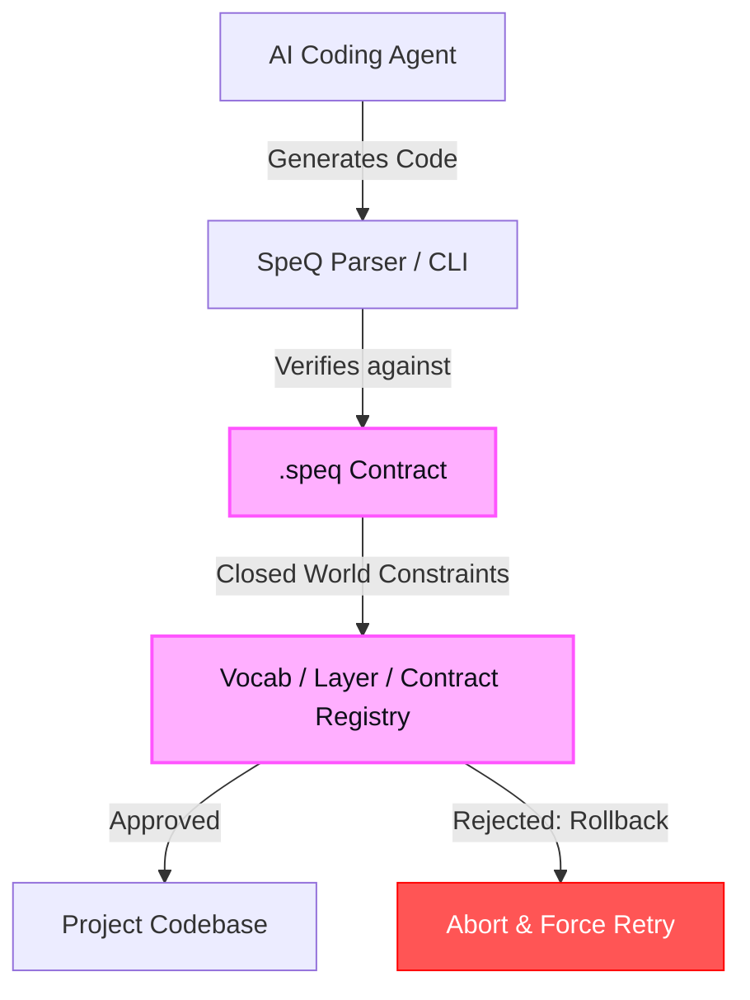
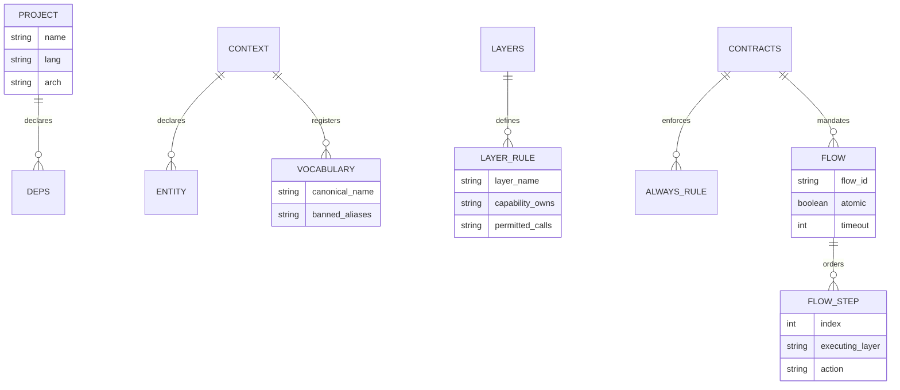

# Principal-Level Guide: SpeQ Architecture & Theory

This guide is written for Senior/Principal Engineers, Staff Architects, and Technical Leaders. It provides a dense, opinionated analysis of the core architectural insights, mathematical theory, and design trade-offs undergirding the SpeQ specification standard.

---

## 🧠 The ONE Core Architectural Insight

Traditional software design relies on **natural language specifications** (PRDs, diagrams, AGENTS.md, or developer READMEs). While highly readable, natural language suffers from **high semantic entropy** when interpreted by LLMs. An AI agent is a probabilistic prediction machine; given undefined structural boundaries, it will collapse the wave function of potential implementations arbitrarily. It will select different naming conventions, routing rules, layer boundaries, and validation checks in every session.

> **The SpeQ Insight:** The role of a specification is not to tell the AI *how* to build, but to **collapse the mathematical state-space of permissible systems** to a singular, reproducible architecture. 

In SpeQ, we treat the architecture of a repository as a **Closed World State Machine**. By declaring a strict EBNF grammar for our DSL, we move from natural language "suggestions" to compiler-grade "constraints."

### Comparison: Vibe-Coding vs. Contract-Based SpeQ (in Rust)

To understand this mathematically, consider how architectural boundaries are represented. In a "vibe-coded" system, boundaries are loosely enforced by name conventions or folders. In a SpeQ-guided system, boundaries are **closed-world type systems**.

Here is how the core insight is modeled in Rust, showcasing how SpeQ restricts the generation of interactions:

```rust
// --- THE VIBE-CODING APPROACH (High Entropy) ---
// Anything goes. The AI can call database pools directly from views, or invent modules.
struct VibeAgent {
    current_layer: String,
}

impl VibeAgent {
    fn execute_operation(&self, action: &str, target_module: &str) {
        // Probabilistic routing. In Session A, the AI might route correctly.
        // In Session B, it might leak credentials in logs or call storage directly.
        println!("Routing {} to {}", action, target_module);
    }
}

// --- THE SpeQ APPROACH (Closed-World Wavefunction Collapse) ---
// Only declared layers exist. Only declared transforms and calls are mathematically possible.

#[derive(Debug)]
pub enum SpeqLayer {
    FRONTEND,
    BACKEND,
    STORAGE,
    PAYMENT,
}

// Strictly declared transforms
pub struct TransformRule {
    pub source: SpeqLayer,
    pub target: SpeqLayer,
    pub action: &'static str,
}

// The closed world registry compiled from a .speq file
pub struct SpeqRegistry {
    pub allowed_layers: Vec<SpeqLayer>,
    pub allowed_transforms: Vec<TransformRule>,
}

impl SpeqRegistry {
    // A SpeQ compiler or verification agent checks this before any code emission
    pub fn verify_interaction(&self, from: &SpeqLayer, to: &SpeqLayer, action: &str) -> Result<(), &'static str> {
        let is_valid = self.allowed_transforms.iter().any(|rule| {
            format!("{:?}", rule.source) == format!("{:?}", from) &&
            format!("{:?}", rule.target) == format!("{:?}", to) &&
            rule.action == action
        });

        if is_valid {
            Ok(())
        } else {
            Err("CONTRACT VIOLATION: Interaction violates closed-world transform boundary!")
        }
    }
}
```

---

## 📊 Visualizing the Architecture

### 1. SpeQ Interaction Boundaries
How SpeQ acts as an interceptor between the LLM and the filesystem:



### 2. SpeQ Domain Model (ER Diagram)
How SpeQ primitives and constructs relate structurally:



---

## ⚖️ Strategic Design Trade-Offs

When adopting SpeQ, engineering organizations must weigh several critical trade-offs:

### 1. Rigidity vs. Expressiveness
*   **The Trade-off:** By making `.speq` a closed world, you strip the AI agent of its creative problem-solving capacity. If you forget to declare `ENTITY notification`, the AI cannot write a notification system, even if it is obviously needed.
*   **The Rational Decision:** **Rigidity is the goal.** We trade initial setup friction for deterministic maintenance. In large codebases, the cost of AI-generated creative drift is order-of-magnitude higher than the cost of updating a configuration file.

### 2. Declarative DSL vs. Code-as-Spec
*   **The Trade-off:** Instead of inventing a new DSL format, why not use OpenAPI, Protobuf, or standard TypeScript interfaces as the source of truth?
*   **The Rational Decision:** Interface definitions (like OpenAPI) only declare *boundary signatures*. They cannot declare behavioral flow contracts (`ATOMIC true` with sequential rollbacks), security classifications (`user.password credential` -> `must-not-log`), or exclusive layer capability locks (`BACKEND NEVER trust_client_total`). SpeQ is designed specifically for **AI behavioral constraint**, which requires holistic coverage of both structure and runtime behavior.

---

## 🗺️ "Where to Go Deep" Reading Order

If you are auditing this codebase to implement SpeQ support or write tooling:

1.  **[SPEC.md](file:///C:/Users/maertzdorf/OneDrive/GitHub/speq/SPEC.md#L59-L150)**: Deep dive into the EBNF grammar to understand how parsing rules are built.
2.  **[SKILL.md](file:///C:/Users/maertzdorf/OneDrive/GitHub/speq/SKILL.md#L48-L136)**: Study the block-by-block behavior instructions to see how agents are directed to interpret each DSL element.
3.  **[examples/shop.speq](file:///C:/Users/maertzdorf/OneDrive/GitHub/speq/examples/shop.speq)**: The most comprehensive spec example, showcasing how multi-layer architectures, transactional flows, and strict security classifications are unified under a single contract.
